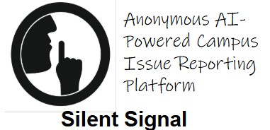
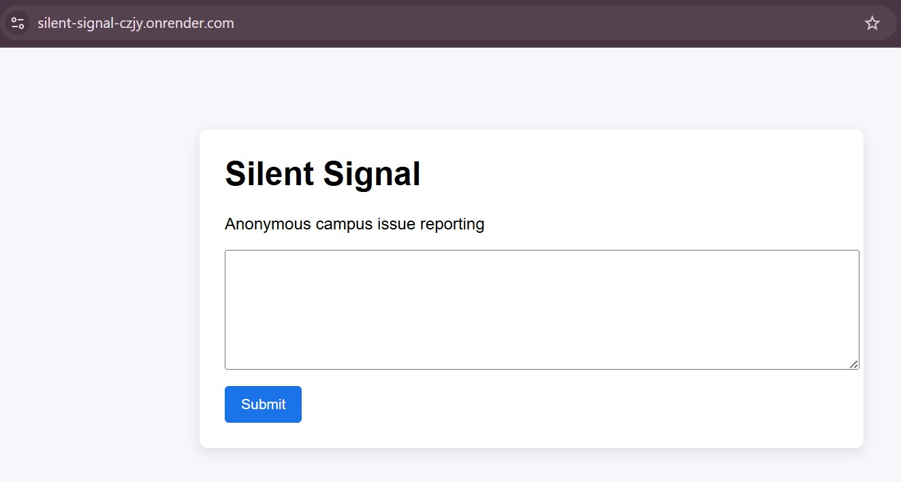
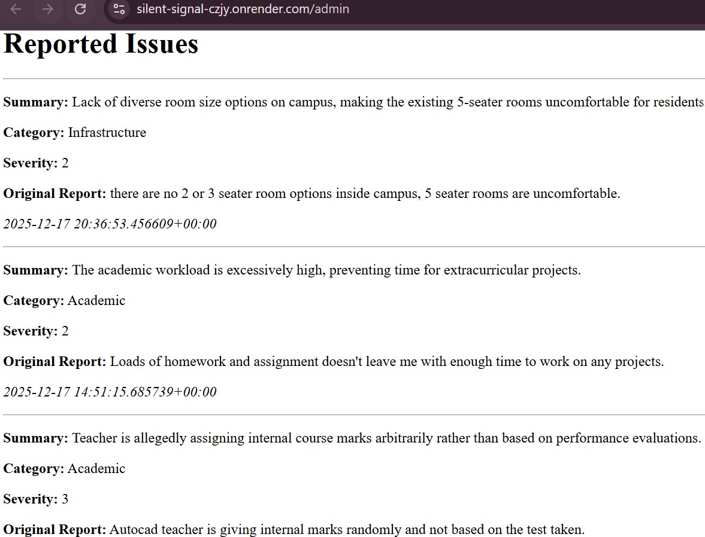
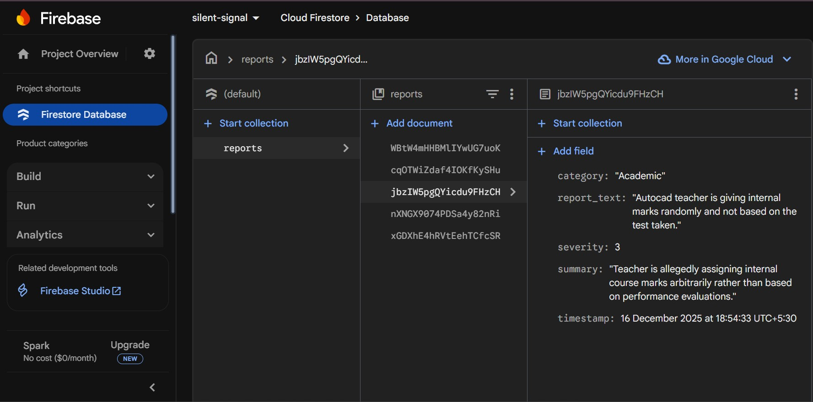

<table width="100%">
  <tr>
    <td width="70%" valign="middle">
      <h1>📢Silent Signal</h1>
    </td>
    <td width="30%" align="center" valign="middle">
      
    </td>
  </tr>
</table>

**Anonymous AI-Powered Campus Issue Reporting Platform**

Silent Signal is a privacy-first web application that enables students to report sensitive campus issues anonymously. Using AI, the system analyzes reports to extract meaningful insights, helping institutions identify recurring problems and take informed action without compromising student safety or identity.

## 🚀 Problem Statement

**Many students hesitate to report campus issues such as:**

- Harassment or ragging
- Safety concerns
- Infrastructure problems
- Academic grievances

This hesitation is often caused by fear of retaliation, social pressure and lack in traditional reportin systems.

### As a result, critical issues remain underreported and unresolved.

## 💡 Solution Overview

**Silent Signal removes identity from the reporting process entirely.**

- No login required

- No personal data collected

- Reports are analyzed using AI to detect patterns

- Admins see issues, not people

### This encourages honest reporting while still providing actionable insights.

## 🧠 Key Features

- 🔒 100% Anonymous Reporting

- 🤖 AI-based Issue Analysis (Gemini API)

- 🧾 Automatic Categorization & Severity Scoring

- 📊 Admin Dashboard for Insights

- ☁️ Cloud-backed Storage using Firebase Firestore

- 🌐 Simple Web Interface

## 🏗️ System Architecture

```python
User Browser
   │
   ▼
Frontend (HTML / CSS / JavaScript)   |-------------------------------------------|
   |                                 | Handles anonymous user input and displays |
   |                                 | submission feedback via a simple web      |
   |                                 | interface                                 |
   |                                 |-------------------------------------------|
   ▼
Flask Backend (Python)  |---------------------------------------------------|
   |                    | Acts as the central controller, handling requests,| 
   |                    | routing data, and coordinating   between AI and   | 
   |                    | database services                                 |
   |                    |---------------------------------------------------|
   |
   ├── Gemini API (AI Analysis)  |---------------------------------------------------|
   |                             | Processes raw text reports to generate summaries, |
   |                             | categories, and severity scores using AI          |
   |                             |---------------------------------------------------|
   | 
   └── Firebase Firestore (Google Cloud)  |---------------------------------------------------|
                                          | Acts as the central controller, handling requests,| 
                                          | routing data, and coordinating   between AI and   | 
                                          | database services                                 |
                                          |---------------------------------------------------|

```

## 🔧 Tech Stack

```md
| Frontend  | Backend | Google Technologies Used |
|-----------|---------|--------------------------|
| HTML      | Python  | Gemini API               |
| CSS       | Flask   | Firebase Firestore       |
| JavaScript|         | Google Cloud Platform    |
```
## 🤖 AI Workflow

1. User submits an anonymous report

2. Backend sends report text to Gemini

3. Gemini returns:

    - Summary

    - Category

    - Severity score

4. Parsed result is stored in Firestore

5. Admin dashboard displays structured insights

## 🖥️ Admin Dashboard

**The admin interface allows authorized viewers to:**

- View all submitted reports

- See AI-generated summaries

- Identify issue categories

Prioritize issues based on severity

> ⚠️ Note: The admin dashboard is intentionally kept separate from user submission flow to preserve anonymity.

## 📷Snapshots of Working MVP

<p align="center">
  
  <br><b>Issue Submission</b>
</p>
<br>
<table>
  <tr>
    <td align="center">
      
      <br><b>Report Analysis</b>
    </td>
    <td align="center">
      
      <br><b>Firestore Database Structure</b>
    </td>
  </tr>
</table>

## 🛡️ Privacy & Ethics

**Silent Signal is designed with privacy as the core principle:**

- No authentication

- No IP tracking

- No personal identifiers

- AI processes only the report content

This ensures ethical use of AI for social good.

## ▶️ Running the Project Locally
```python
# Create virtual environment
python -m venv venv
venv\Scripts\activate

# Install dependencies
pip install -r requirements.txt

# Run the app
python app.py
```


Visit:

👉 http://127.0.0.1:5000 for Regular Access

👉 http://127.0.0.1:5000/admin for Admin Access (local development)

## 🚀 Live Demo
👉 https://silent-signal-czjy.onrender.com for Regular Access

🔒 Admin panel available (restricted access)

> ⚠️ Note: The app may take ~30 seconds to load on first visit due to free-tier cold starts.

## 🧑‍⚖️ Judge / Admin Access

An admin dashboard is available for moderation and issue management.

URL: https://silent-signal-czjy.onrender.com/admin

## 🌱 Future Enhancements

- Heatmap visualization and Pattern Detection

- Time-based trend analysis

- Admin authentication

- Exportable reports

- Mobile-friendly UI

## 🏆 Hackathon Context

This project was built as part of Google TechSprint – GDG Chandigarh University, focusing on:

- Open Innovation

- Ethical AI usage

- Real-world campus impact